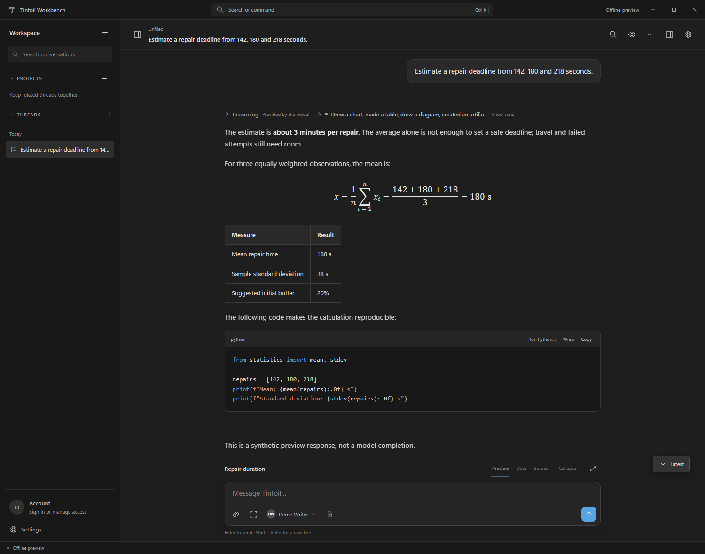
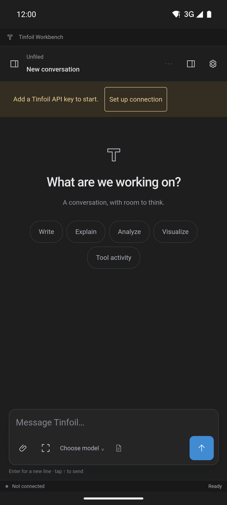
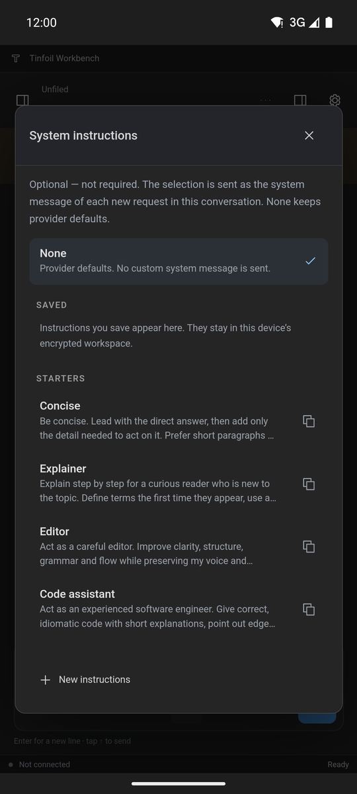
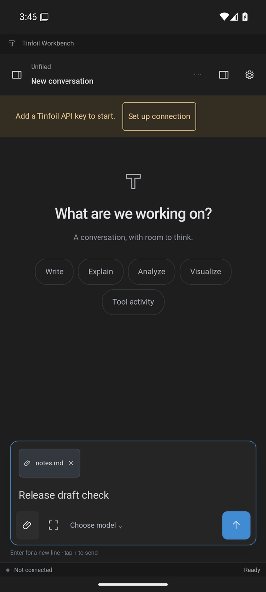

# Tinfoil Workbench 0.12

An unofficial, private client for [Tinfoil](https://tinfoil.sh) confidential AI on **Windows 11** and **Android**. Every connection verifies the Tinfoil enclave before a request is sent. The conversation-first interface has inline charts, tables, diagrams and versioned documents, model-aware thinking controls, branching and editing, and an encrypted local workspace.

**The custom system prompt is optional and not required.** Leave system instructions at None, the default, for ordinary chat. None sends no instructions of yours; it does not remove the provider's own defaults. When tools are on, Workbench's short guide to them is still sent (see below).



## Install

Releases are published on this private repository's **Releases** page. Each release has a `SHA256SUMS` file; compare it with the files you download.

| File | Platform | Notes |
|---|---|---|
| `Tinfoil-Workbench-<version>-x64-Setup.exe` | Windows 11 x64 | Per-user installer; no administrator rights needed |
| `Tinfoil-Workbench-<version>-x64-Portable.exe` | Windows 11 x64 | Runs without installing |
| `Tinfoil-Workbench-<version>-android.apk` | Android 7.0+ | Install manually ("install unknown apps"); needs a current Android System WebView |

The Windows executables are **not code-signed**, so SmartScreen shows a warning the first time you run them. The Android APK is signed with the project's release key (certificate SHA-256 `63:95:EA:D7:97:A5:20:C6:32:15:6A:BC:D9:EE:27:31:86:9C:64:ED:0E:E5:10:AD:5B:52:E8:87:18:54:94:CB`). Later updates install over it only if they are signed with the same key.

On first launch choose **Set up connection**. You can use a developer API key or sign in with a Tinfoil Chat account on Tinfoil's own sign-in page. On Android, sign-in uses your email and password; Google sign-in is not available there.

## Platforms

| | Windows 11 (Electron) | Android (Capacitor) |
|---|---|---|
| Attested chat, reasoning, comparison, branching, editing, projects | ✓ | ✓ |
| Inline visual artifacts, HTML previews, local PDF viewing | ✓ | ✓ |
| Optional system instructions: picker, saved library, starters | ✓ | ✓ |
| Tinfoil web search, text-only delegation | ✓ | ✓ |
| Developer API key | ✓ | ✓ |
| Tinfoil Chat sign-in (website session) | ✓ | email and password |
| Local Python execution (not a sandbox) | ✓ | — |
| Export artifacts as PDF | ✓ | existing PDFs only |
| Encrypted workspace key protection | DPAPI (Windows user) | Android Keystore (device) |

Android details, including the security model and its differences from desktop, are in [docs/ANDROID.md](docs/ANDROID.md).

  

## Build from source

Both platforms build from the same checkout with Node.js 22.12 or newer. Run the commands in the folder containing `package.json`.

### Windows

```powershell
npm run bootstrap      # npm ci from the reviewed lockfile, plus the checksum-verified Electron binary
npm run doctor         # every entry must pass
npm test               # strict TypeScript build and the Node test suites
npm run smoke:desktop  # native DPAPI storage, bridge, PDF print and PDF.js round trip
npm start
npm run dist:win       # reruns doctor, tests and smoke, then builds release\*.exe (x64, unsigned)
```

A successful smoke test prints `DESKTOP_SMOKE_OK`. It uses a temporary profile and never signs in or calls a model. `dist:arm64` exists but has not been validated. The direct dependencies are pinned exactly (Electron 44.4.3, electron-builder 26.17.0, TypeScript 5.8.3, tinfoil 1.2.1, pdfjs-dist 5.4.149). Do not replace them with `latest` or run `npm audit fix --force`.

In the VS Code integrated terminal, clear `ELECTRON_RUN_AS_NODE` before starting Electron (`Remove-Item Env:ELECTRON_RUN_AS_NODE`). The editor sets it for its own processes, and Electron would otherwise start as plain Node.

### Android

Additionally install JDK 21 and an Android SDK with `platforms;android-36` and `build-tools;36.0.0`, then:

```powershell
$env:JAVA_HOME = '<JDK 21>'; $env:ANDROID_HOME = '<Android SDK>'
npm run android:apk    # release APK in release\ (signed when TINFOIL_ANDROID_SIGNING is set)
```

Signing, device tests and the toolchain versions are described in [docs/ANDROID.md](docs/ANDROID.md). The release process for both platforms is in [docs/RELEASING.md](docs/RELEASING.md).

## Accounts, responses and tools

Open Account & connection to choose the connection: the Tinfoil Chat website-session flow or the separate developer API-key mode. Both feed the official verified SDK/EHBP inference adapter, and neither silently falls back to the other.

On Windows, Chat sign-in opens Tinfoil's own sign-in page in a temporary window with no Workbench preload or Node bridge. Chat access renews automatically while that website session lasts. With *Stay signed in on this PC* (on by default), the session is saved on the PC, encrypted with your Windows account, so restarts and updates keep you signed in; signing out ends it and deletes it. It has been tested on Windows; additional sign-in methods have not. On Android, Tinfoil's sign-in page opens on a separate screen with no bridge to the app and a WebView storage profile of its own. Sign in with your email and password (Google and Apple are refused there, since Google does not allow sign-in in embedded views). The website session is kept in the app's private storage while you are signed in and deleted when the app next starts. Chat access renews the same way. Signing in alone does not sync conversations or conceal the locally stored ones. On Windows, adding your Tinfoil chat key under Account → Tinfoil cloud chats shows your Tinfoil Chat cloud chats and projects in Workbench and writes changes made to them back to your account; conversations that exist only in Workbench stay local ([Tinfoil cloud chats](docs/CLOUD.md)). Existing history requires explicit approval before crossing Chat identities or Chat/API modes. [Account behavior and limitations](docs/ACCOUNT.md) describes the integration.

Choose model in the composer lists Tinfoil's chat models with each maker's logo, the model's name and description, marks for reasoning, image input and tool calling, and the context size. The list comes from Tinfoil's public model catalog, fetched without credentials when the picker opens, and from the verified endpoint once a connection is verified. Search matches names, IDs and makers, and any other model ID can still be entered. An empty conversation shows the chosen model's maker logo in place of the Tinfoil mark.

System instructions are optional and not required. The instructions button next to the model in the composer chooses them per conversation: None (the default, which sends no instructions of yours), your saved instructions, or read-only starters you can customize as a copy. A choice applies from the next message, and each answer ends with a quiet line naming the model and the instructions it was sent with. Saved instructions stay in the encrypted workspace. Selecting one copies it into the conversation, so later edits or deletion never change an existing conversation. Instruction names are never sent to a model.

Markdown, LaTeX, source viewing and provider-returned reasoning have separate reading controls. Thinking effort follows each model's reported capabilities, and unsupported models get no controls. Editing a response or an earlier prompt creates an explicit branch. Edited thinking is a local annotation, not model reasoning. Projects organize local threads; they add no shared instructions or model memory.

Visual tools create charts, tables, diagrams and versioned documents inside the answer. Charts can be line, area, bar (grouped or stacked), scatter or pie (one total in up to six parts), with units on their values; hovering or the arrow keys read every series at a point, and the Data tab lists every value. Bar series that never share a label, such as reported values and a projection, are drawn as whole bars centred on their labels. The model learns when to use these tools from a short guide at the start of the system message, sent only while the tools are offered and written in XML sections as Tinfoil Chat's own prompt is; your instructions follow it and take precedence. HTML is static by default; interaction you explicitly enable runs in an opaque, network-restricted frame without native privileges. Local files opened for preview are not sent to a model. See [architecture](docs/ARCHITECTURE.md), [editing and mobile layout](docs/EDITING-AND-MOBILE.md) and [security](SECURITY.md).

Tool batches execute sequentially with per-action approvals. Tinfoil-managed MCP records show provider-reported activity and cannot invoke a local tool. Hosted search and text-only delegation are opt-in; see [activity](docs/ACTIVITY.md). On Windows, Python runs locally with the current user's file and network permissions: **it is not a security sandbox**. Each run needs exact-code approval and a native confirmation.

## Data and backups

Conversations are stored only on the device, in an encrypted workspace:

- **Windows:** the key is protected for the Windows user, so copying `workspace.vault` alone is not a portable backup.
- **Android:** the key never leaves the device's Keystore, and Android backup and device transfer are disabled for the app. Uninstalling the app deletes its conversations.

Use **Export** for plaintext copies, and store exports privately. Back up before upgrading, and avoid opening an updated workspace in an older build.

Keyboard shortcuts on Windows: Ctrl+N new thread; Ctrl+K commands; Ctrl+F conversation search; Ctrl+B sidebar; Ctrl+Shift+F focus; Ctrl+Shift+A artifacts; Ctrl+, Settings. Enter sends and Shift+Enter inserts a newline. On touch layouts Enter inserts a newline and Send submits.

## Verification

[docs/VALIDATION.md](docs/VALIDATION.md) records what ran for this release:

- **Windows:** Node tests, the twelve browser suites, native smoke tests of the source tree and the packaged app, a check that every module the package needs is in it, a live verification of the inference and cloud sync enclaves through the packaged and the installed app, and a silent upgrade over 0.15.1. The tool guide and the charts are checked with scripted model responses. For 0.15.0, Tinfoil cloud chats were checked with a real account from source: the first sync, a read-only check that writing ten real chats back would keep them exactly, and a test chat uploaded, renamed, continued and deleted. That check also restored a real saved sign-in after a restart.
- **Android:** unit tests, and device checks on Android 16 and Android 14 emulators, including a live enclave verification, the model catalog and picker, the sign-in screen and an in-place upgrade from 0.15.1. Chat sign-in was checked with a real account on one phone for 0.13.0, including a key renewal after expiry.

It also lists what did not run. That includes how often real models choose a visual, chat with a real API key, cloud sync and staying signed in with the installed app, cloud sync conflicts with a real concurrent edit, the release-signed Android app with a real account, other physical devices and a clean Windows machine. [docs/HANDOFF.md](docs/HANDOFF.md) is the manual acceptance checklist for those remaining checks.

`preview/index.html` (built by `npm run preview:build`) is a standalone renderer demonstration with labelled synthetic responses; it cannot authenticate. [Rendering measurements](docs/RENDERING.md) describe a synthetic workload.

## Documentation

- [Android app](docs/ANDROID.md) · [Android sign-in](docs/ANDROID-ACCOUNT.md) · [Tinfoil cloud chats](docs/CLOUD.md) · [Releasing](docs/RELEASING.md) · [Validation](docs/VALIDATION.md) · [Manual acceptance](docs/HANDOFF.md)
- [Architecture](docs/ARCHITECTURE.md) · [Security](SECURITY.md) · [Accounts](docs/ACCOUNT.md) · [Activity and tools](docs/ACTIVITY.md) · [Editing and mobile layout](docs/EDITING-AND-MOBILE.md) · [Spacing](docs/SPACING.md) · [Rendering](docs/RENDERING.md)
- [Changelog](CHANGELOG.md) · [Notices](NOTICE.md) · Earlier records in [docs/history](docs/history)

Original application code is private and UNLICENSED; third-party notices are in [NOTICE.md](NOTICE.md). This is an unofficial client, not endorsed by Tinfoil.
