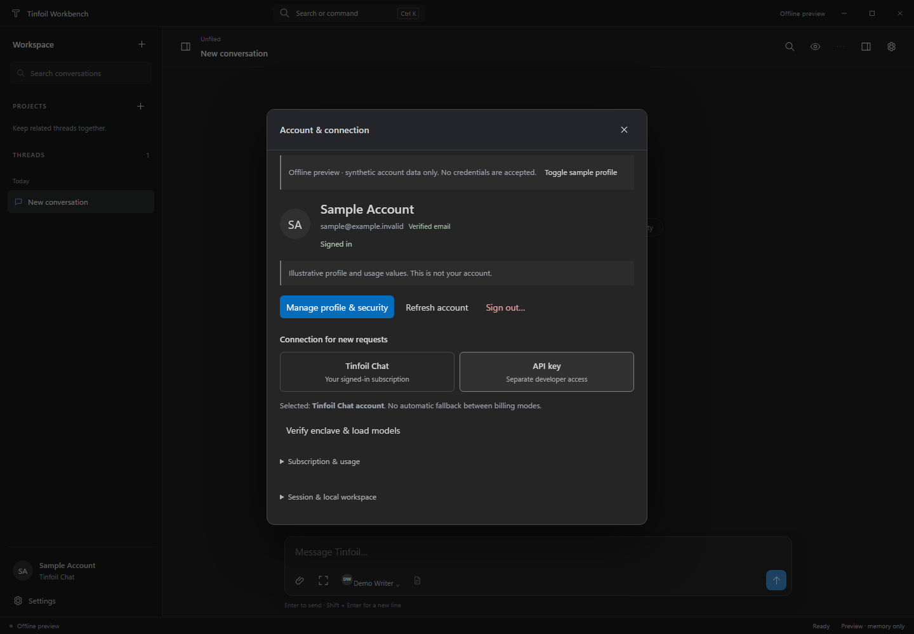

# Tinfoil Workbench 0.9

A Windows 11 chat client in TypeScript and Electron, with a restrained editor-inspired interface, model-aware thinking controls, optional local Python, and versioned visual artifacts.

This is a source implementation. No Windows executable, verified live-provider result, GitHub repository, or green remote CI run is supplied. See [the validation record](../../VALIDATION.md) for exactly what ran.


## Account access in 0.9

**The custom system prompt is optional and not required.** Leave it blank for ordinary chat without a custom system message. The Account view, Advanced field and documentation all state this explicitly.

An **experimental Tinfoil Chat sign-in adapter** now opens the provider's own website in an isolated, temporary window. The main process checks its current Clerk identity and exchanges a session token using the flow published in Tinfoil's web client. Account access and the saved developer API key remain separate modes with no automatic billing fallback. Live website authentication and native Windows execution are not verified in this package.

The Account view shows provider-returned identity, email-verification status and collapsed subscription/usage details. Manage profile & security opens the provider's own interface; Refresh account updates the local display. Sessions last until sign-out or app exit. Signing in does not sync this workspace. Existing history needs native approval before being sent through a different Chat identity or Chat/API mode, and approval itself sends nothing. See [account flow and limitations](../../ACCOUNT.md).



In the offline preview, open **Account & connection** and select **Toggle sample profile**. The sample never authenticates or modifies an account. Real sign-in is available only in the desktop integration, still pending live validation. [Phone](../../account-phone.png) and [tablet](../../account-tablet.png) views use the same production renderer.

## Tool activity in 0.8

Batched function calls are displayed as one expandable group with accurate queued, running, approval, completed, declined, cancelled and failed counts. Execution remains sequential, with individual approvals for protected actions. This is not a cloud Batch jobs API. Completed details render only when opened.

The Chat Completions adapter consumes Tinfoil's published built-in MCP progress markers as provider-reported events. It can request optional Tinfoil web search after explicit configuration; event rendering alone does not enable it. Arbitrary MCP server connections and hosted code-execution session provisioning are not included.

An optional **Text-only sub-agents** setting offers `delegate_task`. Each proposed task requires in-app approval and native confirmation. It makes one separate same-model request with only the explicitly proposed task, no inherited conversation and no tools or recursion. The two-request cap is shared across comparison lanes; child usage remains separate, and Stop sub-agent preserves partial results. This is client orchestration, not an invented native sub-agent API.

Both search and delegation default off. Read [supported interfaces, limits and source references](../../ACTIVITY.md). Use the **Tool activity** starter in the offline preview for a labelled synthetic demonstration. No live model, MCP server or billing operation is exercised by that preview.

## Spacing and layout retained from 0.7

The conversation, inline figures and composer share an 800px maximum reading column with matching scrollbar gutters. A shared 4px spacing scale replaces inconsistent group padding. Phone gutters use 12–16px, tablet gutters 24px and full desktop gutters 32px. Message labels, reasoning, content and actions have deliberate small internal gaps, with larger gaps between turns. Visualizations remain transparent and borderless.

Headers keep the breadcrumb and thread title together. The sidebar search has padded content; project/thread controls and rows align. Figure controls reflow at the figure's own width, including narrow desktop split views. Chart previews remove unused axis-title space without compressing the data plot or changing the standalone print layout; unheaded diagrams no longer reserve a blank heading and trailing row.

The idle composer has a 48px text field and grows for longer drafts. Its measured height keeps Latest above wrapped controls and attachments. A single observer belongs to the composer rather than to every message. A short Default label in the quick effort picker preserves the existing provider-default wire value. Editors share one content inset from heading through footer, with wrap-safe actions on narrow screens. Compact drawer focus restoration can no longer scroll the outer app shell out of view.

See [spacing notes and reproduction](../../SPACING.md), [phone screenshot](../../preview-phone.png), [tablet screenshot](../../preview-tablet.png), and [validation](../../VALIDATION.md).

## Conversation first

Ordinary chat starts with the conversation and composer. Advanced settings and the artifact workspace are closed. Reasoning and completed tool activity are folded; token/timing details are optional. The eye button controls Markdown, mathematics, reasoning visibility, code wrapping, focus mode, automatic workspace opening, and motion reduction. Hiding reasoning changes presentation, not generation or storage.

Returned model reasoning is preserved as the original. The editor can add clearly labelled local revisions to existing thinking text; it cannot fabricate a missing thinking field. Markdown includes tables, highlighted code, safe links and mathematical LaTeX rendered offline through KaTeX-generated MathML. Raw-source views and code copying remain available. Unsupported math preserves source. Remote images are not fetched automatically.

Streaming coalesces dirty work onto scheduled animation frames, preserving open reasoning sections, selected text and inline artifact interaction state. Unchanged response segments are not re-parsed, and closed reasoning is not rendered until opened. Fresh blocks, chart lines and bars receive short entry animations; thinking uses only the actual provider phase. Both OS reduced-motion preferences and the Reading menu can remove host animations. Comparison keeps two independent request histories and requires choosing a reply before continuing. Branch/edit/retry are non-destructive. Saved drafts, instructions, submitted text attachments, tool records and artifacts live in the encrypted workspace; pending attachments and unsaved modal buffers remain session-only.

## Editing, projects and responsive layouts

The composer expand control and every completed prompt/reply use one retained source editor. Answer and Thinking tabs have independent buffers, Write/Preview/Changes views, Markdown/math formatting, native textarea undo, original-text restoration and an unsaved-change guard. Changes shows a bounded changed region, not an expensive document-wide character diff. The preview runs the existing safe Markdown/math renderer and does not execute HTML, Python or tool calls.

Editing a prompt creates an unsent branch draft with its selected attachments still available in that session. Editing a completed reply creates a continuation branch through the selected reply; later turns and the original response remain in the original thread. A revised answer becomes future conversation context exactly once, with existing tool calls/results kept paired. Existing returned thinking can be edited as a **labelled local annotation**; it does not replace tool-protocol reasoning or change model effort settings. The earliest original text remains in the revision record. No edit automatically regenerates a response or executes a tool. Streaming/incomplete replies and active threads cannot be edited, and stale originals fail safely rather than overwrite a newer value.

The sidebar has Workspace, Projects and Threads headers. Projects can be created, renamed, collapsed and removed; removal moves threads to Unfiled rather than deleting them. Threads can move between projects. The header has a project breadcrumb, a real thread title/rename control, and an Original thread link on branches. New project threads and edit branches inherit organizational membership; projects do not add shared instructions, shared model memory or collaboration.

Phone layouts use fullscreen editors, compact thread headers, visible touch actions, and dismissible navigation/advanced/artifact overlays. Tablet portrait uses overlays; larger landscape viewports retain desktop panels. Viewport-aware sizing keeps save/send reachable when the visible height shrinks. Drawers use focus containment, background inertness and Escape/backdrop dismissal, without changing the saved desktop sidebar preference. Charts adapt their actual geometry instead of scaling desktop labels to unreadable sizes. Wide tables scroll inside the visualization. The neutral seamless visualization style and existing cached streaming islands are retained.

This remains a Windows Electron source project. Its renderer and offline preview are responsive; no native iOS/Android build, installable PWA, phone account connection or hosted mobile service is supplied. See [editing and mobile guide](../../EDITING-AND-MOBILE.md), [phone view](../../preview-phone.png), [phone editor](../../editor-phone.png) and [tablet view](../../preview-tablet.png).

## Tools available to models

New conversations enable visual tools independently of Python. Existing workspaces migrate with visual tools **off** until enabled in Advanced. A model whose provider metadata explicitly disables tool calling is not offered any tools; unknown models may reject tool schemas, which is surfaced as a request error.

| Tool | Behavior |
| --- | --- |
| `render_chart` | Line, bar, area or scatter chart from bounded numerical data. Series visibility toggles and a sortable/searchable data view are host-rendered. |
| `render_table` | Typed, sortable, filterable and paginated table. Up to 500 rows and 20 columns. |
| `render_diagram` | Directed node/edge diagram with automatic grid placement or explicit coordinates. This is not Mermaid. |
| `create_artifact` | HTML, SVG, Markdown, JSON, text or PDF. PDF input is self-contained HTML and print CSS. |
| `update_artifact` | Complete-source replacement as a new immutable revision; preserves earlier versions. |
| `read_artifact` | Bounded original source/metadata for an artifact visible in the selected conversation history/current response. Not rendered-pixel vision or general filesystem access. |
| `python` | Optional native Python with explicit approval for every run. Separate from visualization. |
| `delegate_task` | Optional separately approved text-only request to the same model; bounded task context and no recursive tools. |

These are actual function schemas connected to the service's tool loop, not prompts that merely ask the model to pretend it created an artifact. Results include artifact IDs for follow-up reading/revision. Every tool result is matched to its provider call ID. No proprietary ChatGPT/Claude backend is used. Structured visualization never installs packages or executes Python.

Charts accept up to eight series and 200 labels; numeric X values are useful for line/area/scatter charts. Diagrams accept 50 nodes and 100 edges. Full artifact source is limited to 100,000 characters. Tool rounds are bounded to four rounds/eight calls per response. Malformed, disabled or unregistered tools never reach a native executor. A tool error is returned to the model rather than reported as success.

## Inline visualizations and artifact workspace

Visualizations appear directly in the response, between the text that introduces them and the interpretation that follows. A tool insertion offset records that position; older imported artifacts without an offset appear after the answer. Text from earlier tool rounds is preserved without being duplicated in subsequent model context. Revisions share one inline figure and do not replace the reader’s selected revision.

Each figure has Preview/Source views, a Data view for structured visuals, an independent Collapse control, and an Expand button. Expansion opens the existing right-hand workspace. New workspaces **do not auto-open** that panel; the optional Reading setting can restore automatic opening, and an existing explicit preference is respected. `Ctrl+Shift+A` toggles the workspace. Closing it is respected for the rest of the turn.

Charts expose host-controlled series buttons and data tables. Tables support numeric sorting, filtering and eight-row inline pages (50 rows in the workspace). Diagrams expose their edge data. Markdown, JSON, text and PNG also have preview paths. The panel and inline figure DOM are independent of streamed text updates, so a new token does not reset a calculator or selected page/revision.

HTML is **static by default**. Enable interaction explicitly for the current preview to run self-contained inline JavaScript in an opaque sandboxed iframe. Use `addEventListener`; inline event attributes, modules, external scripts, `eval`, bridge APIs and network resources are unsupported. No `allow-same-origin`, popups, workers or native permissions are granted. Stop interaction removes the running frame. Leaving an interactive inline Preview tab or collapsing it also stops that frame; static chart/table view state is retained. Scrolling a running preview off screen does not suspend arbitrary JavaScript. This browser isolation is not a guarantee against resource exhaustion; very expensive scripts can still freeze a renderer.

Save writes the original artifact outside the encrypted vault only after a native dialog. Saving HTML/SVG warns that opening the source in another browser loses Workbench's restrictions. PDF exports are also unencrypted. Local Open file previews PDF, HTML, SVG, PNG and supported text files up to 2 MiB; those previews are temporary and **not sent to the model or added to its artifact scope**. Local previews can be copied as text but are not automatically saved into a conversation.

## Seamless surfaces and lower rendering overhead

Visualizations share the transcript's neutral grey background instead of sitting in navy cards. The outer frame, shadow and extra header strip are gone. Titles and keyboard-accessible controls share one compact row; controls become clearer on hover or focus. SVG canvases are transparent. HTML preview roots use matching dark color-scheme and transparent backgrounds so their actual canvas does not flash opaque white. Blue remains a data-series/focus accent, not the host visualization background. Explicit colors in authored HTML, images and PDFs are not overwritten.

The renderer retains the previous source/options for each live text island and renders only changed islands. Collapsed reasoning is deferred until opened. Bounded math and code caches avoid repeated typesetting/highlighting. Token updates coalesce at 32 ms, or 64 ms for long active text; final and approval states bypass the delay. Hidden-window rendering waits until visibility returns, and a modal pauses underlying transcript updates without losing incoming data.

A shared viewport observer defers initial visualization mounting until it is near the reading area. Static Preview/Data/Source surfaces are retained (at most three per inline selected revision) to preserve table filters and chart controls rather than rebuilding them. SVG toggles reconcile existing nodes. Table searches use a lazy index and a 70 ms debounce; only the current table page is inserted. Once a visualization has been mounted, scrolling does not destroy its state. This is lazy mounting, not unbounded-history virtualization or a promise to pause arbitrary HTML scripts.

Version 0.9 preserves the streaming optimization. Against the authentic 0.8 preview, three runs retained exactly **4,395 processed Markdown characters**, **186,237 template-input characters** and **zero artifact remounts** in the measured phase. Account details render only while the panel is open. These are synthetic work counters, not overall application speed, power, API latency or billing claims. See [rendering measurements](../../RENDERING.md).

## PDF implementation and validation boundary

The desktop print adapter uses a separate JavaScript-disabled, no-preload Electron window with network/file loading blocked. Models can create PDFs from HTML through `create_artifact`; the panel can export existing visual/text/image artifacts as PDFs. PDF source and generated bytes are kept together for later revisions. Output is limited to 2 MiB.

The viewer uses the pinned `pdfjs-dist` dependency, copied locally during build. It renders canvas pages with Previous/Next, zoom and a Page text disclosure; it does not enable PDF scripts, forms, attachment actions or external links. Password-protected PDFs are not supported. Font binaries and remote viewer libraries are not included in this source archive; ordinary PDFs rely on embedded/system fonts, and unusual font/codec cases may need further validation.

**The actual PDF.js library and native Electron printing were not available for execution in preparation.** The renderer's missing-library state was tested and the print adapter uses an injected renderer in service tests. The historical 0.5 shared print-layout fixture passed four checks on one A4 page; it was not rerun in 0.9. Historical records are separated under `docs/history/v0.5/`. The host-generated SVG palette switches to dark labels and high-contrast series for light print pages, while supplied document colors are preserved. These are not substitutes for native integration testing. `npm run smoke:desktop` now prints a synthetic PDF using the production adapter and loads it through the real PDF.js worker on the target machine/CI.

The self-contained offline preview intentionally does not include PDF.js and refuses real PDF/file commands. It demonstrates charts, tables, diagrams and interactive HTML, not live inference or native PDF generation.

## Model-aware reasoning

Effort adjustment, thinking on/off and returned-reasoning visibility are separate concepts. Tinfoil's published `chatConfig.reasoningConfig` metadata is normalized into endpoint-specific safe parameters. The UI shows only supported controls and substitutes the provider's actual effort vocabulary rather than sending a universal low/medium/high setting to every model.

Verified SDK model discovery is enriched, on explicit connection/refresh, by a bounded request to Tinfoil's public model-configuration endpoint. No API key, prompt or transcript is sent with that metadata request. Only whitelisted reasoning fields can be merged; metadata cannot replace credentials, destinations, messages, tools or application permissions. The catalog is held in memory and refreshed with the connection, not silently fetched on every token.

Narrow fallbacks exist for Tinfoil DeepSeek V4 Pro/Flash (`high`, `max`) and the requested Kimi K3 fixed-effort profile (no adjustable effort or invented toggle). These are provider-specific fallbacks, not claims about all DeepSeek/Kimi APIs or model versions. Known live metadata takes precedence. Unrecognized model IDs use provider defaults. Switching models clears earlier effort/mode overrides; comparison lanes use independent capability checks, including two runs of the same model with different efforts. Selecting Provider default omits reasoning overrides entirely.

Reference: [Tinfoil's public model capability definitions](https://github.com/tinfoilsh/tinfoil-webapp/blob/main/src/config/models.ts). The live catalog and account-specific entitlements were not exercised here.

## Optional Python

Settings → Execution chooses an installed Python interpreter. Advanced → Model-requested Python must be set to Ask before every run for the model to request it. Alternatively, Run Python on a completed code block uses that exact stored block. Manual results are not automatically returned to the model.

**Python executes with your account's permissions, not in an OS sandbox or a Tinfoil-hosted interpreter.** Each run requires transcript approval and a second native confirmation showing the actual interpreter and code. There is no always-allow option. The runner's isolated mode, minimal environment, fresh working directory, 30-second timeout and output limits are hygiene controls, not filesystem/network containment. Terminating detached descendants is best effort.

No Python or packages are installed automatically. Ordinary chat, structured visualization and PDF creation do not require Python. Supported generated PNG/SVG/HTML/PDF/CSV/JSON/Markdown/text files in the run's `artifacts` directory can be collected, with eight files and a combined 2 MiB limit. Every Python run starts fresh. For example:

```python
from pathlib import Path
import json
Path('artifacts/result.json').write_text(json.dumps({'answer': 42}), encoding='utf-8')
```

## Run on Windows 11

Install Node.js 22.12 or newer, extract the source, and open PowerShell in its root:

```powershell
npm run bootstrap
npm test
npm start
```

Bootstrap installs declared runtime dependencies (including Tinfoil and PDF.js), resolves/pins Electron and electron-builder, and creates a real lockfile. Package downloads were unavailable here; no lockfile was fabricated. Review the resolved dependency tree, notices and lockfile before publishing. Subsequent bootstrap uses `npm ci`.

```powershell
npm run smoke:desktop
npm run dist:win
```

Packaging targets a per-user x64 NSIS installer and portable executable in `release/`; ARM64 has a separate untested `dist:arm64` command. End users of a completed package do not need Node, WSL, Docker or a GPU for ordinary chat. This source archive is not a tested installer. Windows code signing, native dialogs, DPAPI, process-tree handling and live provider integration still require target-platform validation.

The provider adapter uses the official Tinfoil SDK, explicit successful attestation and EHBP transport. Select **Tinfoil Chat account** in Account for the experimental website-session flow, or **API key** for separate developer billing. Neither mode silently falls back to the other. Real account login, inference and native Windows still require validation; no hosted command session is provisioned. See [Account](../../ACCOUNT.md).

## Development, tests and publishing

`npm test` performs a strict TypeScript build and Node tests. Python tests discover an installed interpreter; `WORKBENCH_TEST_PYTHON` overrides it. `npm run preview:build` rebuilds `preview/index.html`; `npm run preview` serves a localhost demo. Both previews use synthetic in-memory data, reject credentials and are excluded from Windows packaging.

```text
python tests/ui-smoke.py --chromium <path-to-chromium>
python tests/ui-artifacts.py --chromium <path-to-chromium>
python tests/ui-inline.py --chromium <path-to-chromium>
python tests/ui-seamless.py --chromium <path-to-chromium>
python tests/ui-editing.py --chromium <path-to-chromium>
python tests/ui-responsive.py --chromium <path-to-chromium>
python tests/ui-spacing.py --chromium <path-to-chromium>
python tests/ui-activity.py --chromium <path-to-chromium>
python tests/ui-account.py --chromium <path-to-chromium>
# Optional shared print-layout regression, separate from the 0.9 results:
python tests/pdf-layout.py --chromium <path-to-chromium>
```

Those optional browser tests require Python Playwright and Pillow; the PDF layout check also requires PyMuPDF. They are development tools, not application requirements. Native PDF/DPAPI checks run through `smoke:desktop` after dependency bootstrap.

For the offline animation/layout demonstration, open `preview/index.html`, select **Visualize**, and send the inserted prompt. All responses and plotted values in that preview are synthetic.

Keyboard shortcuts: Ctrl+N new conversation; Ctrl+K commands; Ctrl+F in-chat search; Ctrl+B sidebar; Ctrl+Shift+F focus; Ctrl+Shift+A artifacts; Ctrl+, Settings. Desktop Enter sends; Shift+Enter inserts a newline. On a coarse touch pointer, Enter inserts a newline and Send or Ctrl/Cmd+Enter submits. IME confirmation never submits. In the editor, Ctrl/Cmd+Enter saves the revision or draft without generating a response.

No repository or remote workflow was changed for 0.9.

Back up the encrypted vault before upgrading. New binaries accept earlier version-1 workspaces with safe defaults; older binaries may reject or discard newer additive records; avoid opening upgraded workspaces with older builds. Imports cancel active tools and preserve scoped artifact IDs so saved model references remain valid. Refer to [architecture](../../ARCHITECTURE.md), [security](../../../SECURITY.md) and [validation](../../VALIDATION.md) before distribution.
